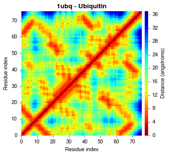
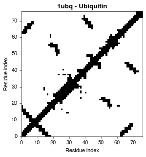

PConPy
======

## Overview




This is the official repository for the redevelopment of PConPy. The original
(now obsolete) source code associated with the article is accessible from the [`legacy`](https://github.com/kianho/pconpy/tree/legacy) branch of this repository.

## About

A [_contact map_](http://en.wikipedia.org/wiki/Protein_contact_map) is a 2D
representation of protein structure that illustrates the presence or absence of
contacts between individual amino acids. This enables the rapid visual
exploratory data analysis of structural features without 3D rendering software.
Additionally, the underlying 2D matrix of a contact map, known as a _contact
matrix_, can naturally be used as numeric input in subsequent automated
knowledge discovery or machine learning tasks. PConPy generates
publication-quality renderings of contact maps, and the related distance- and
hydrogen bond maps.

## Publication

Please consider citing our paper if you found PConPy to be useful in your research:

- H. K. Ho, M. Kuiper and K. Ramamohanarao, "PConPy—a Python module for generating 2D
  protein maps", _Bioinformatics_, vol. 24, no. 24, pp. 2934-2935, 2008.
  [[article](http://dx.doi.org/10.1093/bioinformatics/btn566)]

## Installation

### Dependencies

PConPy was developed using Python 2.7 using the following libraries:
- NumPy
- BioPython
- Matplotlib
- docopt

which can be installed via ``apt-get`` using Ubuntu:
```
sudo apt-get install python-numpy python-biopython python-matplotlib python-docopt
```  
or via the [Anaconda Python Distribution](http://continuum.io/downloads):
```
conda install numpy biopython matplotlib pip
pip install docopt
```

### DSSP

PConPy uses the DSSP secondary structure assignment program to obtain
inter-residue hydrogen bond information. The DSSP executable needs to be
installed into your system path and renamed to `dssp`, it can be
downloaded from:

- ftp://ftp.cmbi.ru.nl/pub/software/dssp/


## Example usage
Generate a PDF contact map using the CA-CA distance measure:
```
python ./pconpy/pconpy.py cmap 8.0 --pdb ./tests/pdb_files/1ubq.pdb \
          --chains A --output 1ubqA_cmap.pdf --measure CA 
```
Generate a PNG distance map using the min. VDW distance measure:
```
python ./pconpy/pconpy.py dmap --pdb ./tests/pdb_files/3erd.pdb \
          --chains B,C --output 3erdBC_dmap.png --measure minvdw
```
Generate a plain-text [hydrogen bond matrix](http://en.wikipedia.org/wiki/Protein_contact_map#HB_Plot):
```
python ./pconpy/pconpy.py hbmap --pdb ./tests/pdb_files/1ubq.pdb \
          --chains A --plaintext --output 1ubq.txt
```

## Who's using PConPy?

- B. Konopka, M. Ciombor, M. Kurczynska and M. Kotulska, "Automated
  Procedure for Contact-Map-Based Protein Structure Reconstruction", The
  Journal of Membrane Biology, vol. 247, no. 5, pp. 409-420, 2014.
  [[article](http://dx.doi.org/10.1186/1471-2105-10-153)]

- A. Stivala, A. Wirth and P. Stuckey, Tableau-based protein
  substructure search using quadratic programming, BMC Bioinformatics, vol.
  10, no. 1, p. 153, 2009.
  [[article](http://dx.doi.org/10.1007/s00232-014-9648-x)]


## Useful links

- Peter Cock's (@peterjc) [tutorial](http://goo.gl/q7DNt7) covers the
  basics of PDB file parsing and visualisation using the powerful
  [Biopython](http://biopython.org) library.


## Contributors

See [CONTRIBUTORS.md](CONTRIBUTORS.md)
